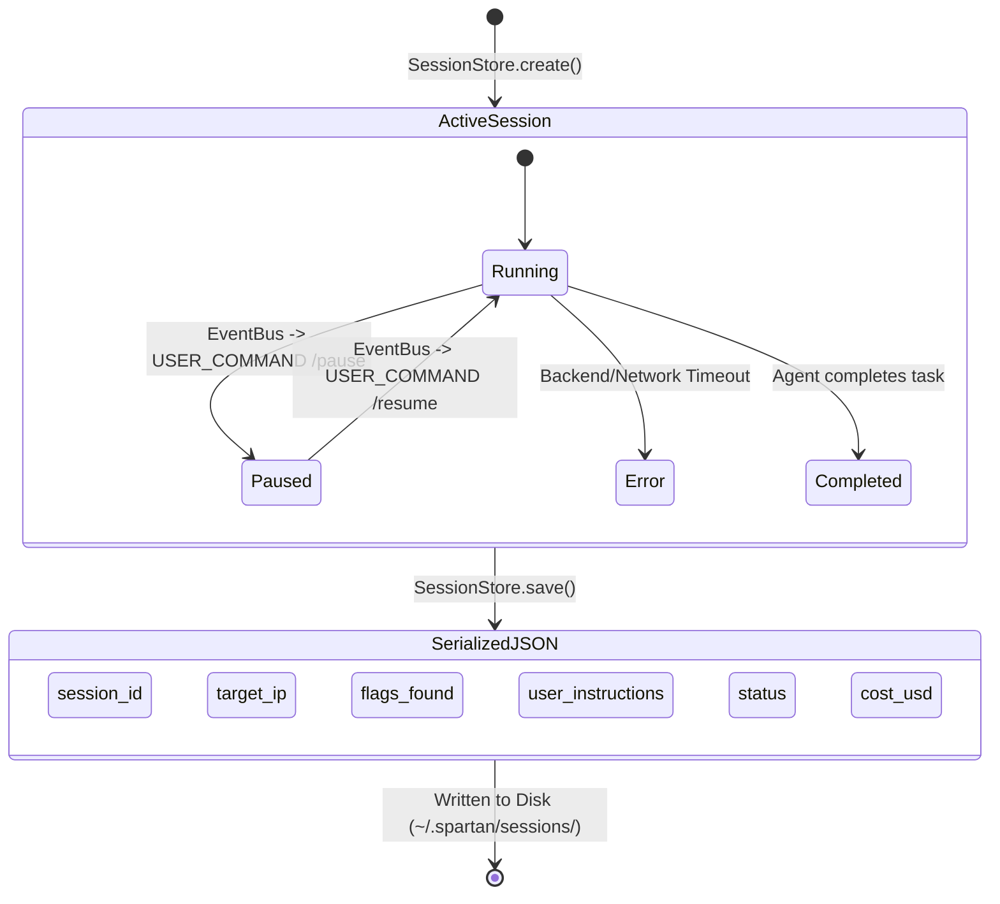

# SPARTAN: The Definitive Project Architecture Bible

## 1. EXECUTIVE SYSTEM OVERVIEW

### Core Purpose
**Spartan** is an advanced, dual-mode cybersecurity penetration testing agent and multi-LLM orchestration framework. It is designed to assist, automate, and drive authorized penetration testing engagements in controlled lab environments (like HackTheBox or TryHackMe). By providing a stateful, event-driven, sandboxed execution environment, it bridges the gap between high-level LLM reasoning and low-level bash/system execution. 

The system operates in two distinct modes:
1. **The Autonomous Engine (`spartan/`)**: A fully autonomous pipeline that uses stage-based execution (Discovery, Enumeration, Exploitation, Privilege Escalation) using a unified local tool-calling backend (Ornith 1.0 via Ollama).
2. **The Legacy Engine (`spartan_legacy/`)**: A human-in-the-loop, multi-LLM interactive terminal UI (TUI) that allows an operator to orchestrate multiple LLM personas simultaneously, managing distinct reasoning, parsing, and execution paths.

### Primary Tech Stack
- **Language**: Python 3.10+ (Statically typed with `mypy` and `pydantic`).
- **Core Frameworks & Libraries**:
  - `pydantic`: For rigorous schema validation and state serialization.
  - `rich` / `prompt_toolkit`: For the interactive CLI and Terminal UI components.
  - `openai` (Python SDK): Used to connect to Ollama endpoints running local models via an OpenAI-compatible API layer.
  - `subprocess` / `pty`: For isolated, pseudo-terminal bash execution (`BashSandbox`).
- **External Dependencies/APIs**: 
  - **Ollama**: Serves the primary LLM backend for local, offline execution. Specifically, the system is hardcoded to connect to `http://localhost:11434/v1` for the "Ornith 1.0" model.
  - **Docker**: For containerized execution, complete with OpenVPN (`NET_ADMIN`, `tun`) capabilities to connect to pentesting labs.

### Architectural Style
The project employs an **Event-Driven, Stage-Based Pipeline** architecture for its autonomous core, and a **Model-View-Controller (MVC) over TUI** architecture for its legacy system. 
- The autonomous core utilizes a **Singleton Event Bus** to decouple the backend LLM execution loop from the frontend console renderers.
- Execution happens inside an isolated **State Machine**, where the system transitions through distinct pentesting phases, resetting memory context while persisting critical findings.

---

## 2. DIRECTORY & REPOSITORY TOPOGRAPHY

The codebase is strictly bifurcated into the modern autonomous engine (`spartan/`) and the older interactive engine (`spartan_legacy/`), surrounded by infrastructure and testing suites.

```text
/
├── spartan/                  # Modern, fully autonomous pentesting engine.
│   ├── core/                 # Core business logic: pipeline, controller, backend, sandbox.
│   ├── interface/            # Entry points and CLI renderers.
│   └── prompts/              # System and stage-specific prompts (Discovery, Exploit, etc.).
│
├── spartan_legacy/           # Human-in-the-loop, multi-model TUI orchestrator.
│   ├── llm/                  # Provider registry (Ollama/OpenAI compatible), clients, and config.
│   ├── ui/                   # Rich/prompt_toolkit based Terminal UI.
│   ├── utils/                # Legacy CLI logic and file management utilities.
│   └── prompts/              # Legacy system prompts.
│
├── tests/                    # Exhaustive testing suite.
│   ├── unit/                 # Pure mock-based unit tests for core logic.
│   ├── integration/          # Tests requiring a live environment but not full isolation.
│   ├── docker/               # Tests executed within the built spartan Docker container.
│   └── legacy/               # Regression tests for `spartan_legacy/`.
│
├── workspace/                # Mounted via Docker. The physical output directory for findings.
├── pyproject.toml            # Poetry/Pip configuration defining `spartan` and `spartan-legacy` CLIs.
├── Makefile                  # Build, test, and typecheck automation (scoped primarily to `spartan/`).
├── Dockerfile                # Image definition for the Spartan execution environment.
├── docker-compose.yml        # Orchestration containing network capabilities for OpenVPN.
└── LLM.md                    # System-level guidelines and architectural philosophy documentation.
```

---

## 3. CORE ARCHITECTURAL PILLARS (EXHAUSTIVE FILE BREAKDOWN)

The `spartan/core/` directory acts as the absolute brain of the autonomous mode. Below is an exhaustive file-by-file parameter mapping of every core architectural pillar.

### `spartan/core/config.py`
* **Purpose**: Manages global configuration loading and environment parsing using `pydantic_settings`.
* **Key Classes/Methods**: `SpartanConfig`, `load_config(**overrides: object) -> SpartanConfig`
* **Parameters/Inputs**:
  * Loads from environment variables (`.env`) or explicit kwargs passed to `load_config()`.
  * Config fields: `llm_model`, `llm_api_key`, `llm_api_base`, `max_iterations`, `working_directory`, `target`, `custom_instruction`, `mode`, `verbose`.
* **Outputs**: Returns a strictly validated `SpartanConfig` object used across the application to drive paths and endpoints.

### `spartan/core/events.py`
* **Purpose**: Implements a thread-safe Singleton Pub/Sub `EventBus` to decouple the autonomous loop from the CLI/UI.
* **Key Classes/Methods**: `EventType` (Enum), `Event`, `EventBus` (`get()`, `subscribe()`, `emit_state()`, `emit_tool()`, `emit_message()`).
* **Parameters/Inputs**:
  * `subscribe(event_type: EventType, handler: Callable[[Event], None])`
  * Emitting requires distinct kwargs mapped to convenience methods (e.g., `status: str`, `name: str`, `result: Any` for `emit_tool()`).
* **Outputs**: Dispatches `Event` objects containing a `dict[str, Any]` payload to registered asynchronous callbacks.

### `spartan/core/session.py`
* **Purpose**: Manages persistent state ensuring the agent can pause, crash, and resume exactly where it left off.
* **Key Classes/Methods**: `SessionInfo`, `SessionStore`
* **Parameters/Inputs**:
  * `SessionStore.create(target: str, task: str, model: str) -> SessionInfo`
  * `SessionStore.load(session_id: str) -> SessionInfo | None`
* **Outputs**: Serializes the `SessionInfo` dataclass (tracking flags, tasks, costs, `target_ip`) into a `.json` file stored locally at `~/.spartan/sessions/`.

### `spartan/core/sandbox.py`
* **Purpose**: The execution boundary. Runs shell commands securely via `asyncio.create_subprocess_shell` and captures output.
* **Key Classes/Methods**: `CommandResult`, `ToolDispatcher`, `parse_tool_arguments()`
* **Parameters/Inputs**:
  * `ToolDispatcher.dispatch(tool_name: str, arguments: dict[str, Any]) -> str`
  * Supported tools (OpenAI Tool Schema): `execute_command(command: str, timeout: int)`, `write_file(path: str, content: str)`.
* **Outputs**:
  * Returns structured `CommandResult` containing `exit_code: int`, `stdout: str`, `stderr: str`, `timed_out: bool`.
  * `to_tool_response()` converts this to a truncated string (capped at `80_000` chars) for LLM ingestion to prevent context explosion.

### `spartan/core/backend.py`
* **Purpose**: Adapts the `AsyncOpenAI` SDK to communicate with local Ollama endpoints running Ornith 1.0. Manages the full tool-calling retry loop to correct malformed JSON outputs dynamically.
* **Key Classes/Methods**: `OrnithBackend`, `AgentMessage`, `MessageType`
* **Parameters/Inputs**:
  * `__init__(working_directory: str, system_prompt: str, model: str, base_url: str)`
  * `query(prompt: str)` kicks off the background `_conversation_loop()`.
* **Outputs**:
  * `receive_messages() -> AsyncIterator[AgentMessage]`: Asynchronously yields events (`TEXT`, `TOOL_START`, `TOOL_RESULT`, `RESULT`, `ERROR`) via an `asyncio.Queue` back to the Controller.

### `spartan/core/controller.py`
* **Purpose**: Orchestrates the lifecycle of a *single stage*. Binds the Backend, Sandbox, SessionStore, and EventBus. Processes pause/resume interrupts.
* **Key Classes/Methods**: `AgentState` (Enum), `AgentController`
* **Parameters/Inputs**:
  * `__init__(config: SpartanConfig, backend: AgentBackend, session_store: SessionStore, events: EventBus)`
  * `run(task: str, resume_session_id: str | None) -> dict[str, Any]`
* **Outputs**:
  * Returns a result dictionary containing `success: bool`, `output: str`, `flags_found: list[str]`, `session_id: str`, `cost_usd: float`.

### `spartan/core/pipeline.py`
* **Purpose**: Manages the overarching pentest. Sequentially executes distinct pipeline stages. Explicitly resets the conversational history between stages while preserving and injecting summarized findings.
* **Key Classes/Methods**: `StageDefinition`, `PipelineResult`, `StageResult`, `PipelineOrchestrator`
* **Parameters/Inputs**:
  * `__init__(config: SpartanConfig, stages: list[StageDefinition], mode: PipelineMode)`
  * `run() -> PipelineResult`
* **Outputs**:
  * Yields `PipelineResult`, combining `StageResult` objects (status, flags, costs) for all executed stages.

### `spartan/core/pipelines.py`
* **Purpose**: Factory module assembling stages for specific penetration testing run modes.
* **Key Classes/Methods**: `get_stages(mode: PipelineMode) -> list[StageDefinition]`
* **Parameters/Inputs**: 
  * `PipelineMode` enum (`CTF`, `PENTEST`, `PASSIVE`).
* **Outputs**:
  * Returns an ordered `list[StageDefinition]` mapped to the specific prompt builder functions located in `spartan.prompts.stages`.

---

## 4. THE "SPARTAN LEGACY" ENGINE (INTERACTIVE)

The `spartan_legacy/` system is built for operators who want granular, manual control over LLMs during a pentest.

### 1. `spartan.py` Orchestrator (`spartan_legacy/utils/spartan.py`)
* **Purpose**: The main controller for the legacy TUI. It manages the user input loop, catching `/commands` (like `/bash`, `/clear`, `/save`) and routing normal text to the active LLM.

### 2. TUI / Rich UI (`spartan_legacy/ui/`)
* **Purpose**: Uses `prompt_toolkit` to provide a persistent input bar at the bottom of the terminal while maintaining a scrolling history of LLM and Bash outputs above it via `rich` Layouts.

### 3. LLM Registry & Factory (`spartan_legacy/llm/`)
* **Purpose**: Supports local execution via Ollama (specifically the `ollama:ornith` model).
* **Mechanism**: `client.py` wraps an asynchronous provider (`BaseProvider`) into a synchronous `LLMClient` that automatically trims conversation history based on a character/token budget to prevent context overflow.

---

## 5. EXECUTION FLOWS

The execution of the autonomous engine is deeply isolated. The orchestrator controls stage transitions, the controller oversees the loop, and the backend communicates with the local LLM.

```mermaid
sequenceDiagram
    participant CLI as CLI Interface
    participant Orchestrator as PipelineOrchestrator
    participant Controller as AgentController
    participant Backend as OrnithBackend
    participant Sandbox as BashSandbox
    participant Ollama as Local Ollama (Ornith 1.0)
    
    CLI->>Orchestrator: start(target_ip)
    
    rect rgb(20, 20, 30)
        Note over Orchestrator, Ollama: STAGE 1 (e.g. Discovery)
        Orchestrator->>Controller: run(stage_task)
        Controller->>Backend: query(system_prompt + task)
        
        loop Tool Calling Loop
            Backend->>Ollama: chat_completion(messages, tool_schema)
            Ollama-->>Backend: response(tool_calls=[execute_command])
            
            alt Malformed JSON intercepted
                Backend->>Ollama: Issue corrective prompt
                Ollama-->>Backend: Valid tool JSON
            end
            
            Backend->>Sandbox: dispatch("execute_command", args)
            Sandbox-->>Backend: CommandResult(stdout, stderr, exit_code)
            Backend->>Backend: append result to message history
        end
        
        Backend->>Ollama: chat_completion(messages)
        Ollama-->>Backend: final_text_response (Stage Complete)
        Backend-->>Controller: AgentMessage(TEXT)
        Controller-->>Orchestrator: StageResult(success, output, flags)
    end
    
    Orchestrator->>Orchestrator: Summarize findings, destroy old context
    
    rect rgb(20, 20, 30)
        Note over Orchestrator, Ollama: STAGE 2 (e.g. Exploitation)
        Orchestrator->>Controller: run(stage_task + stage1_findings)
        Controller->>Backend: query(...)
    end
```



### A. Error Recovery Flow
1. LLM attempts to call a tool but hallucinates the name (e.g., `execute_bash` instead of `execute_command`) or emits a `Tool Call:` regex matching block outside the JSON array.
2. The `OrnithBackend` intercepts the error.
3. Rather than crashing, it silently generates a faux `user` response: `[SYSTEM] Your previous tool call to '...' had malformed JSON arguments... Please re-issue`.
4. The LLM processes this failure on the next turn and natively corrects itself via retry loops.

---

## 6. DATA & STATE MANAGEMENT

State is not left to the whims of the LLM's context window. It is rigorously externally managed.



- **`SessionState`**: The source of truth for the engagement. The agent interacts with it to record progress. This is serialized directly to disk (`.spartan_session.json`). If the container crashes, running `spartan resume` reloads this JSON and reconstructs the `PipelineOrchestrator` from the exact stage it died on.
- **Event-Driven UI**: Because the core engine is decoupled, state changes (like a successful exploit or tool execution) trigger events. The UI subscribes to these events and renders them, ensuring the core logic is never blocked by UI rendering bounds.
- **Context Trimming**: In the legacy mode, `LLMClient._trim()` enforces a hard byte-budget based on `context_window * 4 * 0.8`, dropping older messages but ensuring the leading prompt is always a "user" prompt. In the autonomous mode, context is safely handled by stage isolation.

---

## 7. TESTING & VALIDATION STRATEGY

Spartan utilizes a multi-tiered testing strategy, highly isolated from production labs.

1. **Unit Tests (`tests/unit/`)**: Strictly uses `unittest.mock`. Validates the logic of `PipelineOrchestrator`, `OrnithBackend` retry mechanisms, and `SessionState` serialization without invoking Docker or Ollama.
2. **Integration Tests (`tests/integration/`)**: Tests how components interact, particularly ensuring the `BashSandbox` correctly maintains state (e.g., `cd` persists) and timeouts function correctly.
3. **Docker Tests (`tests/docker/`)**: Exhaustive tests that build the `Dockerfile` and ensure the internal environment (dependencies, python paths) operates identically to the end user's experience.
4. **Legacy Tests (`tests/legacy/`)**: Ensures the `spartan_legacy` CLI continues to function, protecting older workflows from regressions caused by the new autonomous engine.

**Note:** The `Makefile` exposes a `make typecheck` command that currently only targets the `spartan/` directory via `mypy`, ignoring legacy code to prevent refactoring bottlenecks.

---

## 8. DEPLOYMENT & ENVIRONMENT

Spartan is designed to run in highly hostile network environments (e.g., directly connected to VPNs on HackTheBox).

- **Dockerization**: The provided `Dockerfile` isolates the Python environment and sandbox. 
- **Networking**: `docker-compose.yml` explicitly grants `cap_add: [NET_ADMIN]` and maps `/dev/net/tun`. This allows OpenVPN to run *inside* the Spartan container, routing the sandbox's bash commands directly to the target lab network without requiring host-level routing configuration.
- **Volumes**: A local `./workspace` is mounted inside the container at `/workspace`. Any files created by the LLM (exploits, scripts, loot) are accessible natively on the host machine.
- **CLI Commands**: 
  - `spartan start/resume` -> Routes to `spartan.interface.main` (Autonomous).
  - `spartan-legacy` -> Routes to `spartan_legacy.main` (Interactive).
